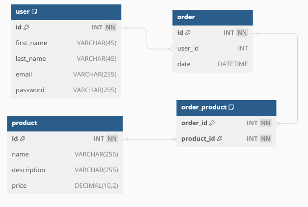

# Introduction

Demonstrate how Querydsl works on complex query cases by extending JPA in SpringBoot project. 

One of advantages of using Querydsl is that we can still make use of JPA functionality and extend more dynamic 
entity operations, especially, you have used JPA in your project. 

Type safety is also an important feature of Querydsl. In this way, a developer can reduce the failed operations 
of mismatched columns based on the string-based query statement.

# Tech stack

- JDK 17
- SpringBoot 3.x
- JPA 3
- QueryDSL 5.x

# Setup
I used JDK 17 in this project. Compared to the old JDK (before 17), one of the big differences is the Java EE package 
has been changed to `jakata` from `javax`, so when using querydsl 5.x, we need to specify its classifier as `jakarta`.

build.gradle
```groovy
dependencies {
    ...
    compileOnly 'com.querydsl:querydsl-apt:5.0.0:jakarta'
    implementation 'com.querydsl:querydsl-jpa:5.0.0:jakarta'
    annotationProcessor 'com.querydsl:querydsl-apt:5.0.0:jakarta'
    annotationProcessor "jakarta.annotation:jakarta.annotation-api"
    annotationProcessor "jakarta.persistence:jakarta.persistence-api"
}
```

After executing `./gradlew classes`, the Querydsl will automatically generate the Q-Type class based on entities defined 
in your project in build folder.

```shell
.
├── build
    └── classes
      └── java
          └── main
            └── com
                └── example
                    └── entity
                        ├── Order.class
                        ├── Product.class
                        ├── User.class
                        ├── QProduct.class  <- generate by Querydsl APT
                        ├── QUser.class     <- generate by Querydsl APT
                        └── QOrder.class    <- generate by Querydsl APT

```

# Project Structure

## ERD
Tables : 
- user : a user profile.
- product : all products.
- order : all product orders.
- order_products : a relationship tables between order and products.



## How to use Querydsl

see [/src/test/java/com/example/test/RepositoryTest.java](./src/test/java/com/example/test/RepositoryTest.java)

# References
- http://querydsl.com/static/querydsl/5.0.0/reference/html_single/#jpa_integration
- https://www.baeldung.com/intro-to-querydsl